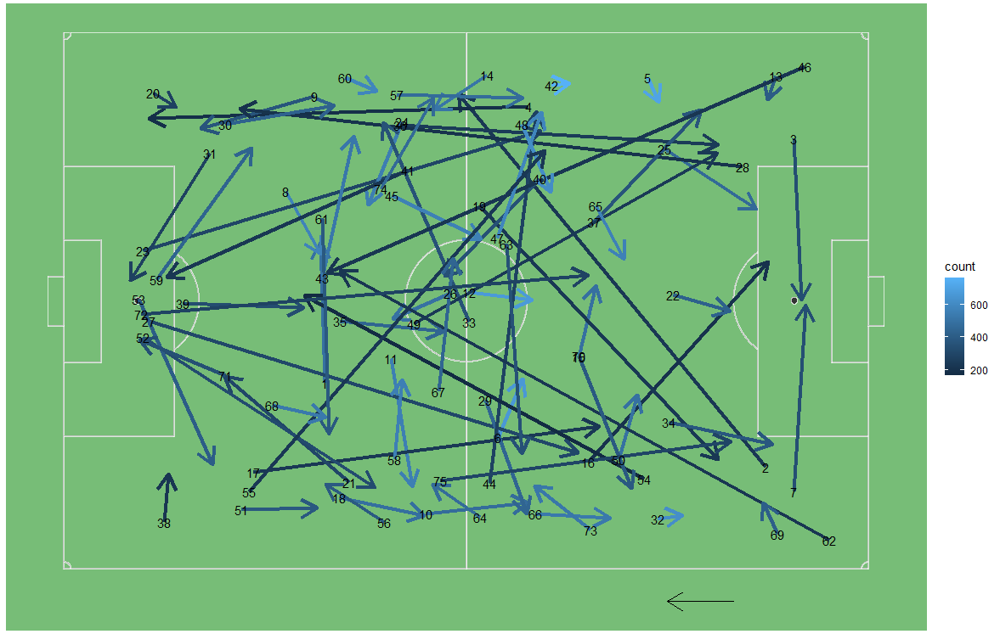

# StatsBomb Squad Rotation and Clustering Passes
Using Friends of Trackings *'Getting Started with R + StatsBomb | Analyzing Squad Rotation & Clustering Passes'* as a guide, I have been able to create graphics for results with squad rotation and pass clusters.

After transforming and cleaning the StatsBomb data, I wanted to see a teams result upon rotation in the Premier League 2003/04 season. All team apart from Arsenal didn't look very exciting, therefore I have a chart that shows every team in the league that rotated thoughout the season according to the data. I had some trouble with getting all the teams in because some had not rotated. To get around this I used *if(w==team) next* to step over any teams that had no rotation so they didn't take up blank space.

Sticking with the Premier League 2003/04 season, we can use cluster passes to help understand the passes tendencies and lanes for each team. The field below shows Liverpool most common clusters using 75 clusters, again, according to the data.

Finally, I identified clusters that Liverpool do more than 1.5 standard deviation than the league average. Unfortunately (even a lower value), the data suggests Liverpool did not have more than 1.5 standard deviation than the league average.

# What I Learnt

- Working through transforming the StatsBomb Data.
- Squad Rotations.
- Creating Pass Clusters.
- Standard Deviation, a quantity expressing by how much the members of a group differ from the mean value for the group.
